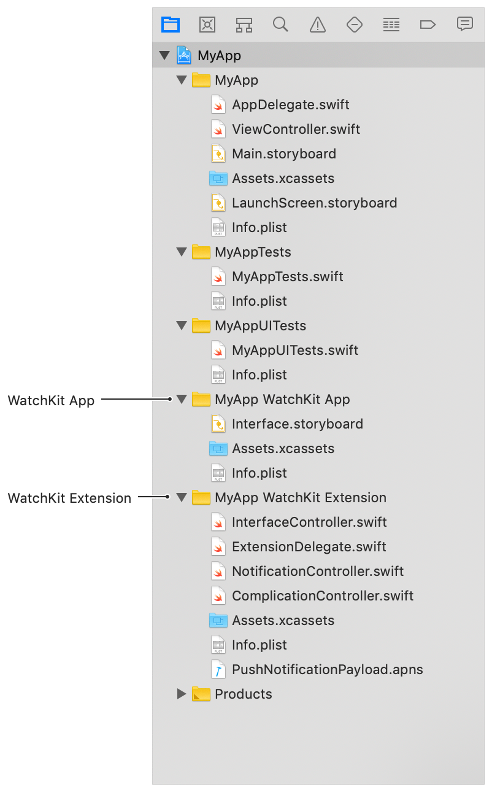

# CleanWarch

Collection of Apple Watch apps using **SwiftUI + Combine**

- [Overview](#overview)
- [Targets](#targets)
  * [WatchKit App](#watchKit-app)
  * [WatchKit Extension](#watchKit-extension)
- [References](#references)

## Overview

Before you start a new watchOS project, you need to decide how you’re going to distribute that project:
- as a watch-only app
- as a watchOS app with an iOS app.

If your app is only available on Apple Watch, create a new watch-only project.
If you want a watchOS and iOS app that deliver a related experience, either create a new project that bundles the two apps, or add a watchOS target to an existing iOS project.

## Targets

Regardless of whether you add a watchOS app to an existing project or create a new project that contains both an iOS and watchOS app, Xcode automatically configures the targets for your watchOS app and adds the needed files.

Xcode divides the watchOS app into two sections.

- WatchKit App
- WatchKit Extension

Xcode sets the **bundle IDs** for both of the watch targets based on the container’s ID.
- For a watch-only app, this ID is the bundle ID for the root target.
- For a watchOS app with an iOS app, this ID is the iOS app’s bundle ID.

The root of the WatchKit app and WatchKit extension’s bundle IDs must match the container’s bundle ID. If you change your iOS app’s bundle ID, you must update the other bundle IDs accordingly.

### WatchKit App

An app bundle that contains your watchOS app’s **storyboard** and any assets used by the storyboard.

When developing your watchOS app, edit your app’s storyboard in the WatchKit app.

### WatchKit Extension

An extension that contains your watchOS app’s **code**.
When developing your watchOS app write your app’s code in the WatchKit extension.

Your WatchKit extension connects to controls and views in the storyboard using WKInterfaceObject subclasses such as WKInterfaceButton and WKInterfaceLabel.

These interface objects act as proxies for your storyboard elements. Use the interface elements to configure the elements in code.

## References

- [Setting Up a watchOS Project](https://developer.apple.com/documentation/watchkit/creating_independent_watchos_apps/setting_up_a_watchos_project)
